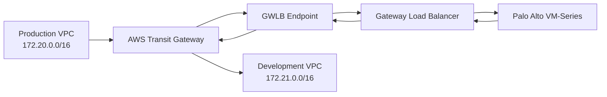

# Centralized AWS Transit Gateway Inspection with Palo Alto VM-Series

A production-inspired AWS networking lab that routes traffic between segmented VPCs through a centralized Palo Alto VM-Series firewall using AWS Transit Gateway, Gateway Load Balancer, and Gateway Load Balancer Endpoints.

## Project status

Successfully deployed and validated in `eu-west-1`.

- Production-to-Development ICMP traffic was explicitly allowed.
- Production-to-Development SSH traffic was explicitly denied.
- Palo Alto traffic logs confirmed both policy decisions.
- The entire environment is managed with Terraform.

## Architecture overview

The environment contains four VPCs:

| VPC | CIDR | Purpose |
|---|---|---|
| Production | `172.20.0.0/16` | Production workload |
| Development | `172.21.0.0/16` | Development workload |
| Shared | `172.22.0.0/16` | Shared services and hybrid connectivity |
| Inspection | `172.23.0.0/16` | Centralized Palo Alto and GWLB inspection |

Traffic flow:



## Key AWS components  

- AWS Transit Gateway with separate spoke, inspection, and hybrid route tables
- Transit Gateway VPC attachments with appliance mode on the inspection attachment
- Palo Alto VM-Series Next-Generation Firewall from AWS Marketplace
- AWS Gateway Load Balancer using GENEVE on port `6081`
- Gateway Load Balancer Endpoint for transparent service insertion
- Dedicated Production, Development, Shared, and Inspection VPCs
- Private Amazon Linux 2023 test instances
- EC2 Instance Connect Endpoints for private administrative access
- Terraform-managed routing, security groups, interfaces, and test infrastructure

## Inspection policy validation

| Test | Source | Destination | Result | Palo Alto rule |
|---|---|---|---|---|
| ICMP | `172.20.10.10` | `172.21.10.10` | Allowed, 0% packet loss | `allow-prod-to-dev-icmp` |
| TCP/22 | `172.20.10.10` | `172.21.10.10` | Denied, command exited `124` | `deny-prod-to-dev-all` |

The Palo Alto traffic log recorded the denied TCP/22 sessions with action `deny` and end reason `policy-deny`, proving that enforcement occurred on the centralized firewall.

## Routing design

The spoke Transit Gateway route table is associated with the Production, Development, and Shared VPC attachments. Its default route points to the Inspection VPC attachment.

The inspection Transit Gateway route table is associated only with the Inspection VPC attachment. Routes for the spoke CIDRs are propagated back through their respective attachments.

Inside the Inspection VPC:

1. Traffic arriving from the Transit Gateway is routed to the Gateway Load Balancer Endpoint.
2. The endpoint forwards traffic through the Gateway Load Balancer to the Palo Alto firewall using GENEVE.
3. Inspected traffic returns through the endpoint route table.
4. The traffic is sent back to the Transit Gateway and forwarded to the destination VPC.

This arrangement keeps inspection centralized while preserving symmetric flows required by a stateful firewall.

## Lab availability model

The subnet and routing design spans two Availability Zones, but this cost-controlled lab deploys one Palo Alto firewall and one active Gateway Load Balancer Endpoint in `eu-west-1a`.

A production deployment should use at least one firewall target and one Gateway Load Balancer Endpoint per Availability Zone, with automated bootstrap configuration and centralized Palo Alto management.

## Routing design

The spoke Transit Gateway route table is associated with the Production, Development, and Shared VPC attachments. Its default route points to the Inspection VPC attachment.

The inspection Transit Gateway route table is associated only with the Inspection VPC attachment. Routes for the spoke CIDRs are propagated back through their respective attachments.

Inside the Inspection VPC:

1. Traffic arriving from the Transit Gateway is routed to the Gateway Load Balancer Endpoint.
2. The endpoint forwards traffic through the Gateway Load Balancer to the Palo Alto firewall using GENEVE.
3. Inspected traffic returns through the endpoint route table.
4. The traffic is sent back to the Transit Gateway and forwarded to the destination VPC.

This arrangement keeps inspection centralized while preserving symmetric flows required by a stateful firewall.

## Lab availability model

The subnet and routing design spans two Availability Zones, but this cost-controlled lab deploys one Palo Alto firewall and one active Gateway Load Balancer Endpoint in `eu-west-1a`.

A production deployment should use at least one firewall target and one Gateway Load Balancer Endpoint per Availability Zone, with automated bootstrap configuration and centralized Palo Alto management.

## Prerequisites

- Terraform compatible with the versions defined in `versions.tf`
- AWS CLI configured with suitable permissions
- An AWS account with access to `eu-west-1`
- An active subscription to the Palo Alto VM-Series PAYG offer in AWS Marketplace
- An RSA public key for EC2 and firewall administration
- Awareness of Transit Gateway, Gateway Load Balancer, EC2, data-transfer, and Marketplace charges

> The Palo Alto Marketplace subscription and free-trial cancellation are not controlled by `terraform destroy`.

## Deployment

Review the variables and provide your own management CIDR and SSH public key through an untracked `terraform.tfvars` file.

```hcl
management_allowed_cidr = "YOUR_PUBLIC_IP/32"
ssh_public_key          = "YOUR_RSA_PUBLIC_KEY"
```

## Palo Alto configuration

Terraform deploys the AWS infrastructure and bootstraps the VM-Series appliance. The following firewall configuration was applied through the Palo Alto CLI for this lab:

- Configured `ethernet1/1` as a Layer 3 DHCP interface
- Disabled creation of a default route from DHCP
- Added `ethernet1/1` to the `default` virtual router
- Added `ethernet1/1` to the `inspection` zone
- Enabled HTTP and ICMP health checks through an interface-management profile
- Enabled the AWS GWLB inspection plugin
- Created an ICMP allow rule from Production to Development
- Created a subsequent deny rule for all other Production-to-Development traffic

The security rules were evaluated in this order:

1. `allow-prod-to-dev-icmp`
2. `deny-prod-to-dev-all`

For a production implementation, firewall configuration should be automated and centrally managed using Panorama or another controlled configuration pipeline.

## Verification

After deployment, confirm that the GWLB target is healthy and the endpoint is available:

```bash
aws elbv2 describe-target-health \
  --region eu-west-1 \
  --target-group-arn <TARGET_GROUP_ARN>

aws ec2 describe-vpc-endpoints \
  --region eu-west-1 \
  --filters Name=vpc-endpoint-type,Values=GatewayLoadBalancer
```

From the Production test instance:

```bash
ping -c 4 172.21.10.10

timeout 5 bash -c 'echo > /dev/tcp/172.21.10.10/22'
echo $?
```

Expected results:

- ICMP succeeds with `0% packet loss`
- The TCP/22 test exits with code `124`
- Palo Alto logs ICMP against `allow-prod-to-dev-icmp`
- Palo Alto logs TCP/22 against `deny-prod-to-dev-all` with end reason `policy-deny`

## Cost and teardown

This lab creates billable resources, including Transit Gateway attachments, Transit Gateway data processing, Gateway Load Balancer capacity, Gateway Load Balancer Endpoint usage, EC2 instances, EBS volumes, and a Palo Alto Marketplace appliance.

Destroy the Terraform-managed infrastructure when testing is complete:

```bash
terraform plan -destroy -out=destroy.tfplan
terraform apply destroy.tfplan
```

Then verify that no Terraform-managed resources remain:

```bash
terraform state list
```

Finally, cancel the Palo Alto AWS Marketplace subscription separately. Destroying the EC2 instance does not cancel the Marketplace agreement or prevent the free trial from converting to a paid subscription.

## Important limitations

- The lab uses a single Palo Alto target and is not highly available.
- Only one Availability Zone has an active inspection path.
- Palo Alto policy configuration is not currently managed by Terraform.
- Terraform state is local and unsuitable for team or production use.
- A production deployment should use remote encrypted state, state locking, CI validation, automated firewall configuration, monitoring, and multi-AZ firewall capacity.
